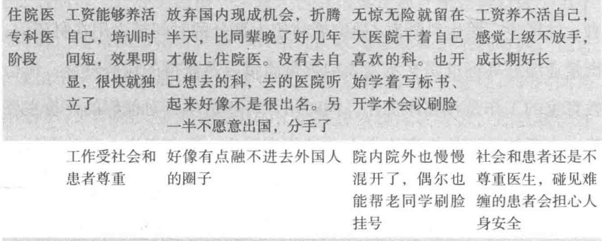
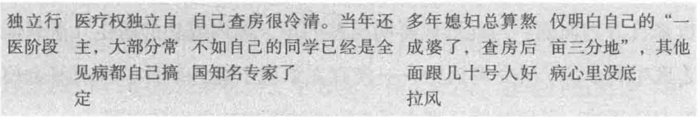
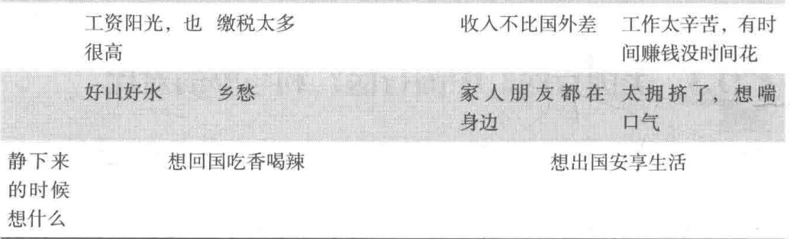

# Practice Abroad

赴美行医的观点与看法

**郭中昊**

---

# 中美行医对比

## 培养过程

- 中国：本科5年 → 硕士研究生3年 → 博士研究生4-5年 → 升主治1年 → 升副高5年 → 升正高5-10年 → ……

  - 总结：一切非常顺利的话，35岁拿到副高，40+岁拿到正高
- 美国：本科4年 → 医学院4年（M.D.） → 住院医生（residency）3-7年 → 主治医师（attending） → （可能的专培Fellowship 1-3年） → ……没了？

  - 总结：一切非常顺利的话，28岁成为大内科主治，31岁成为专科（如心内）主治

---

# 中美行医对比

## 工作方式

- 中国：临床+科研两手抓，晋升看文章、基金、关系
- 美国：临床、科研、教学，任意组合。
  - 只做临床：8am-5pm，周末休息
  - 临床+科研：在学术型医院/大学附属医院工作，25h/w临床，其他时间做研究、申基金。有体面、有声誉，收入不一定比上面高
  - 临床+教学：参与住院医/专科医生教学，成为program director，在大学讲课
  - **重要的是：工作方式可以随着我的想法改变**

---

# 中美行医对比

## 收入

- 中国：主治收入也不错，越到后面收入越好
- 美国：收入远高于当地平均收入，但交税也多，大概30%（不过有各种避税方法）
  - 心内：490k/年
  - 消化内：453k/年
  - 大内科：264k/年
    - Hospitalist（住院部医生）：上7天（8am-8pm），休7天
  - 公卫/预防/儿科（最低）：243k/年

---

# 中美行医对比

## 优劣对比

---

---

# 中美行医对比

## 优劣对比

---

如何赴美行医？
